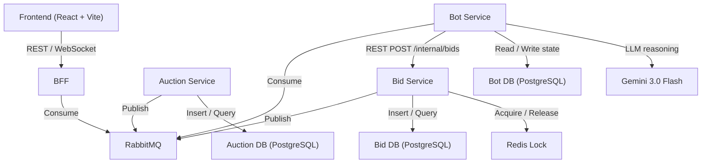

# AI Bidding Platform

An autonomous AI auction platform where bot agents with distinct personalities compete in real-time auctions. Watch AI agents strategize, bid, and outmaneuver each other -- all visible through a live React dashboard.

## Architecture



**4 Go backend services** communicate via REST (sync) and RabbitMQ (async events):

| Service | Responsibility |
|---|---|
| **Auction Service** | Auction lifecycle -- create, start/end, determine winners |
| **Bid Service** | Bid validation, persistence, concurrency control via Redis locks |
| **BFF** | WebSocket fan-out to dashboard, data aggregation for frontend |
| **Bot Service** | ADK Go agents with unique personalities, event-driven bidding |

## Tech Stack

**Backend:** Go, Gin, PostgreSQL, Redis, RabbitMQ

**Frontend:** React, Vite, TanStack Query, Tailwind CSS, shadcn/ui

**AI Agents:** Google ADK for Go, Gemini 3.0 Flash (streaming)

**Infrastructure:** Railway (backend + databases), Vercel (frontend)

## How It Works

1. **Auction Service** periodically creates auctions with AI-generated item descriptions, random prices, and durations
2. Events fan out via **RabbitMQ** to all consumers (Bot Service + BFF)
3. **Bot agents** (each with a distinct personality) independently evaluate auctions and place bids via REST to the Bid Service
4. **Bid Service** uses Redis distributed locks to ensure atomic bid processing -- no race conditions
5. Successful bids publish events that other bots react to, creating competitive dynamics
6. **BFF** consumes all events and pushes them to the **React dashboard** via WebSocket in real-time

### Bot Personalities

- **Aggressive Alice** -- Bids early and high, targets collectibles
- **Sniper Steve** -- Waits until the final seconds, wins by minimum margin
- **Value Victor** -- Only bids on genuine bargains below estimated value
- **Chaos Charlie** -- Random bidding for stress testing
- **Learning Lucy** [future] -- Adapts strategy based on historical performance

## Project Structure

```
AI-Bidding-Platform/
├── services/
│   ├── auction-service/     # Auction lifecycle management
│   ├── bid-service/         # Bid processing + Redis locking
│   ├── bff/                 # WebSocket gateway + data aggregation
│   └── bot-service/         # ADK Go AI agents
├── shared/
│   ├── events/              # Event schemas + routing keys
│   └── pkg/                 # Small shared utilities
├── frontend/                # React + Vite dashboard
├── infra/
│   ├── compose/             # docker-compose.yml for local dev
│   └── migrations/          # Database migration files
├── docs/                    # Project documentation
├── go.work                  # Go workspace file
└── Makefile                 # Common tasks
```

## Prerequisites

- Go 1.22+
- Node.js 20+
- Docker & Docker Compose

## Getting Started

```bash
# Start infrastructure (Postgres, Redis, RabbitMQ)
make infra-up

# Run all backend services
make run-all

# Run the frontend (separate terminal)
make run-frontend
```

### Default Ports

| Service | Port |
|---|---|
| BFF | 8080 |
| Auction Service | 8081 |
| Bid Service | 8082 |
| Bot Service | 8083 |
| React dev server | 5173 |
| PostgreSQL | 5432 |
| Redis | 6379 |
| RabbitMQ | 5672 (AMQP), 15672 (management UI) |

## Documentation

- [Project Design Doc](docs/AI_Bidding_Platform_Docs.pdf) -- Full architecture, flows, and design decisions
- [Coding Standards](claude/claude.local.md) -- Go conventions, patterns, and service rules